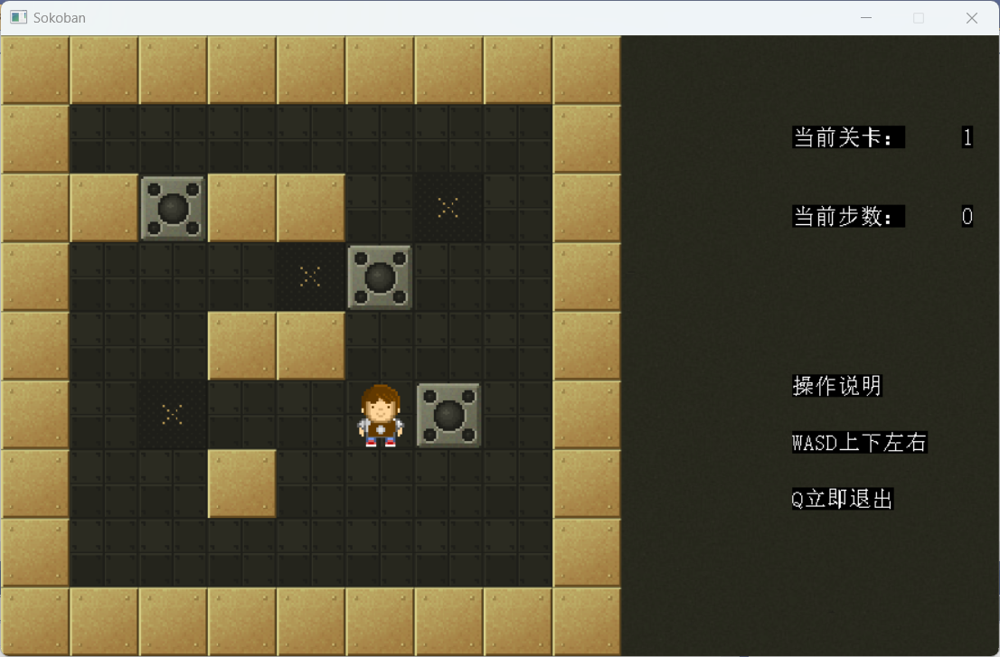
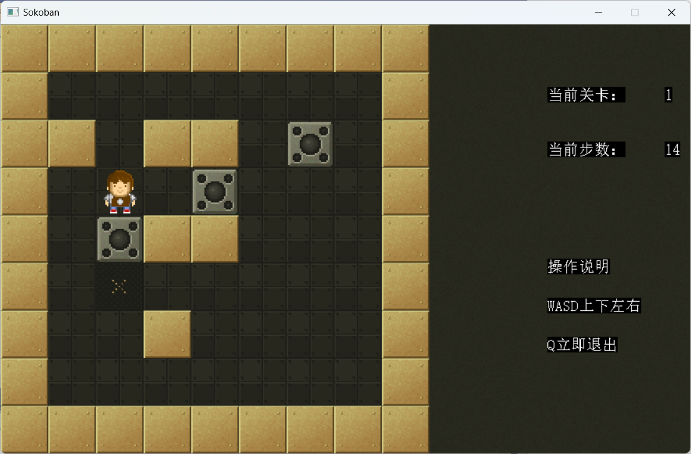
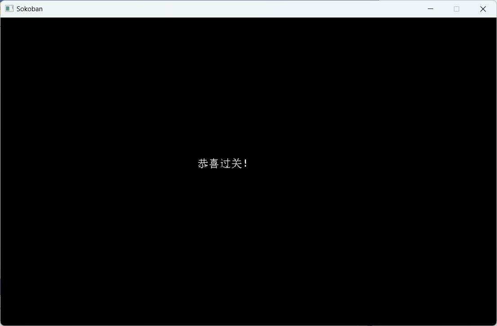
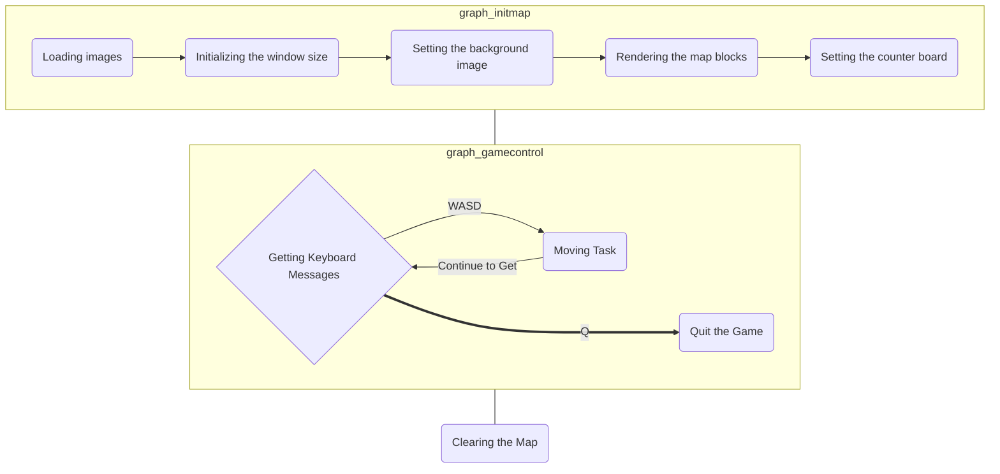

# Sokoban

It's a game of pushing boxes, a program developed based on Visual Studio and `EasyX`. All the code is process-oriented.

## Running

Download the project files, then click on the.sln solution file and click "Run".

Here are several running screenshots:

1. Initialization interface

2. Running process

You can move by pressing WASD and quit by pressing Q.

3. Ending animation

After the game ends, the program will close automatically.

## Principle Explanation

### Flowchart

### Explanation of Key Algorithms

The key here is the algorithm for the moving task. A simple simulation is adopted. First, determine the direction, calculate the coordinates of the current task, and then update the textures of several points on the map according to the changes in the coordinates.

## License

This project has no license. 