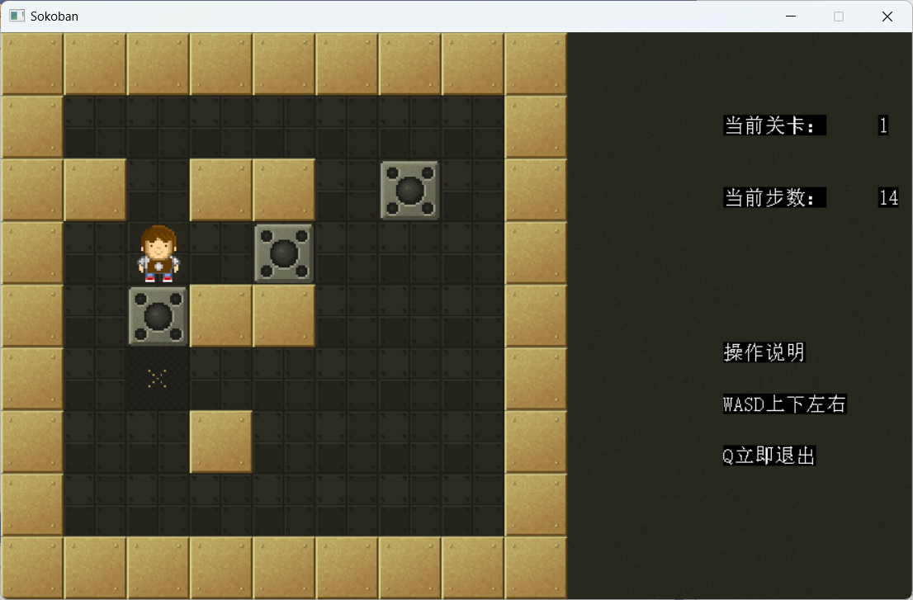

# Sokoban
一个推箱子的游戏，基于Visual Stdio和EsayX开发的程序。所有代码均是面向过程的。

## 运行
下载项目文件，然后点击sln解决方案，点击运行即可

给出几个运行截图

1. 初始化界面

2. 运行过程

   可以按WASD移动，按Q退出。

   

3. 结束动画

   

结束后会自动关闭程序

## 原理说明

### 流程图

### 关键算法说明

这里关键是移动任务的算法，这里采用的是简单的模拟，首先判断防线，计算当前任务的坐标，然后根据坐标的东西更新地图上的几个点的贴图。

## 许可证

本项目无任何许可证